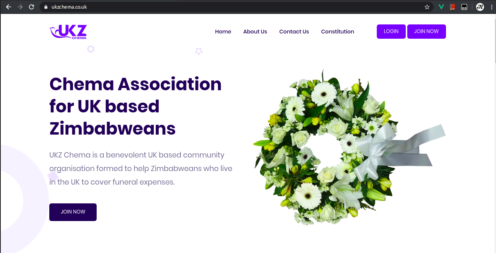
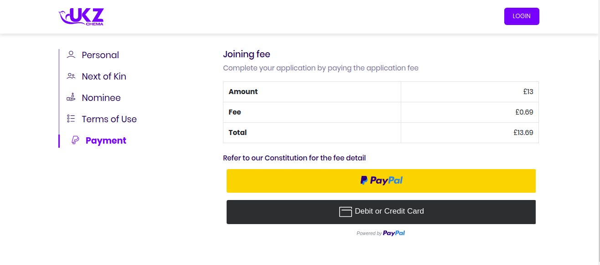
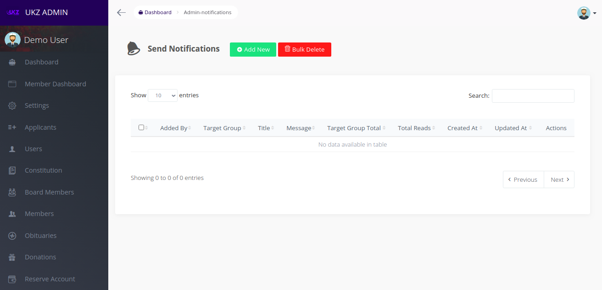
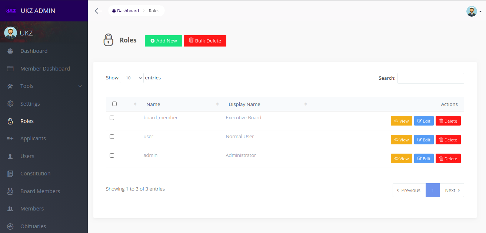

# UKZ Chema Documentation

### Table of Contents
- [UKZ Chema Documentation](#ukz-chema-documentation)
    - [Table of Contents](#table-of-contents)
  - [Member](#member)
      - [Joining / Registration](#joining--registration)
      - [Login](#login)
    - [Members Dashboard](#members-dashboard)
      - [Dashboard](#dashboard)
      - [Obituary](#obituary)
      - [Deposits](#deposits)
      - [Donations](#donations)
      - [Member's Profile](#members-profile)
      - [Next of Kin](#next-of-kin)
      - [Nominees](#nominees)
      - [Notifications](#notifications)
      - [Change Password](#change-password)
      - [Logout](#logout)
  - [Admin](#admin)
    - [Generating Reports](#generating-reports)
    - [Sending Notifications](#sending-notifications)

## Member

A **Member** is a beneficiary of a system who participates in donating and can get donations in case of one of his/her nominees or next of kin passes on.

#### Joining / Registration

To Join UKZ Chema Association, one must read and understand the [Constitution](https://ukzchema.co.uk/constitution) and should meet the requirements specified.

Funds for joining fee of the specified amount should be readily available in your credit/debit card or your [PayPal](https://www.paypal.com/) account to start.

Visit our [Joining Page](https://ukzchema.co.uk/join-now) on [https://ukzchema.co.uk/join-now](https://ukzchema.co.uk/join-now)

The following details are required to become a member:
- Your Personal Details
- Your Next of Kin's Details
- [Nominees](#nominees) (Optional)
- Accepting UKZ Chema's Terms of Use specified in the [Constitution](https://ukzchema.co.uk/constitution)

Complete the payment process via PayPal Account, Credit/Debit Card

After successful application, wait for approval from UKZ Chema Association Board Members. You will receive an email withing 48 Hours with a **Create Password Link.**

#### Login

To login visit [Login Page](https://ukzchema.co.uk/login) and enter your email and password. You will be redirected to [Member's Dashboard](https://ukzchema.co.uk/member)

### Members Dashboard

#### Dashboard

Welcome page for members with quick links

#### Obituary

List of all added obituaries with links to either view or donate if a member hasn't donated

#### Deposits

List of all deposits by a logged in member

#### Donations

List of all donations made a logged in member

#### Member's Profile

Page to View and/or Edit logged in member profile

#### Next of Kin

Page to view and/or edit member's Next of Kin details

#### Nominees

Page to view and/or edit member's Nominees (given it's the period to do so).

#### Notifications

Shows notifications received by a member

#### Change Password

Page to change member password.

#### Logout

Link to logout and exit current member's session

## Admin

Admin refers to a Board Member who can perform tasks like accepting member's application, add obituary, send notifications to all members and to generate reports such as donations report, reserve account reports and deposits report.

There is also a master admin who can add and remove Board Members.

### Generating Reports

Administrators can generate a pdf report using the **Download PDF** option on respective pages for example [Members Page](https://ukzchema.co.uk/admin/members)

### Sending Notifications

System allows administrators to send notifications to all members.